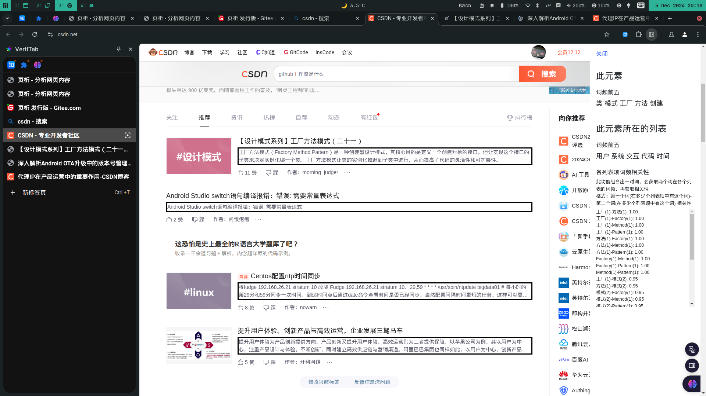

---
# https://vitepress.dev/reference/default-theme-home-page
layout: home
title: 主页
themeConfig: 
  logo: /icon.png

hero:
  name: "页析"
  text: "一个浏览器扩展，分析网页内容"
  tagline: 由一名初中生开发
  actions:
    - theme: brand
      text: 下载
      link: https://gitee.com/qwe12345678/web-page-analysis/releases
    - theme: alt
      text: 开源地址
      link: https://gitee.com/qwe12345678/web-page-analysis
    - theme: alt
      text: 加入页析交流群
      link: http://qm.qq.com/cgi-bin/qm/qr?_wv=1027&k=ZSFDgYBuFcamqGDjYEiMhMSe2omdeue0&authKey=g5TeSPdx3Jguu44uv5c364qevtKlfu2tfn%2FzA5VLHTDg71ED2tY44L6iWfeT2%2Fk%2B&noverify=0&group_code=854260276
    - theme: alt
      text: Wiki
      link: markdown-examples.html

features:
  - title: 获取整个网页的词频的词云图
    details: 显示频繁出现的词的词云图
  - title: 选择网页中的一个列表分析
    details: 获取某个列表项的词频、整个列表的词频
  - title: 选择网页中的一个列表分析
    details: 获取各个列表项中某个词的词频与另一个词的词频的相关性 
---

## 开发者
qwe12345678：页析、小浏览器、标题分词搜索、Mhdhhf浏览器、Mhedhf工具箱、Mhdhhf相机开发者  

欢迎提出建议  

[Github](https://github.com/183600)  

[Gitee](https://gitee.com/qwe12345678)  

[QQ](https://qm.qq.com/q/r2mS09tT6a)  

[博客](https://qwe12345678.pages.dev/)  

